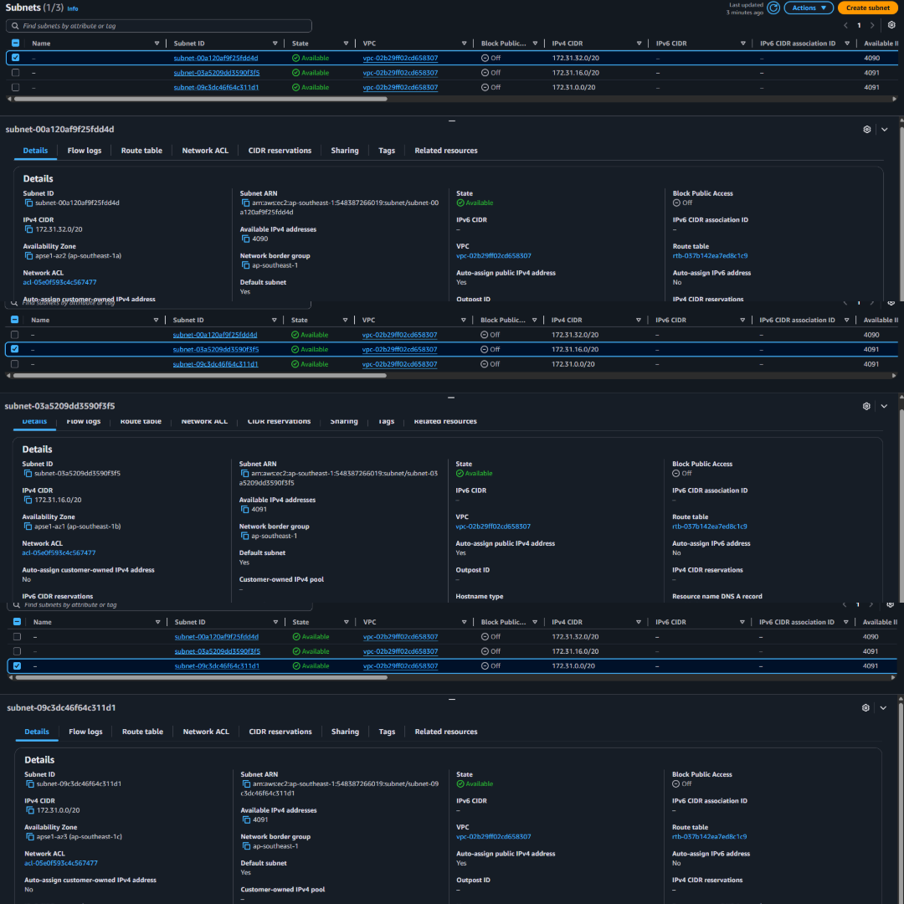
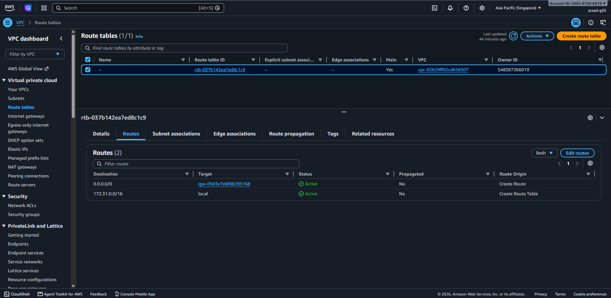
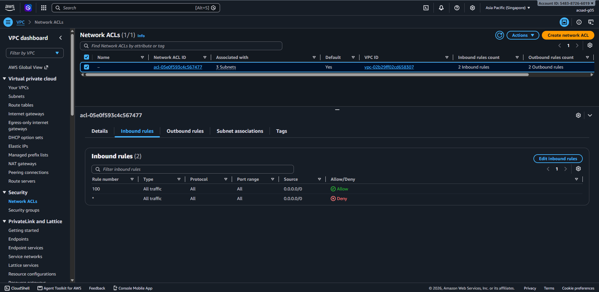
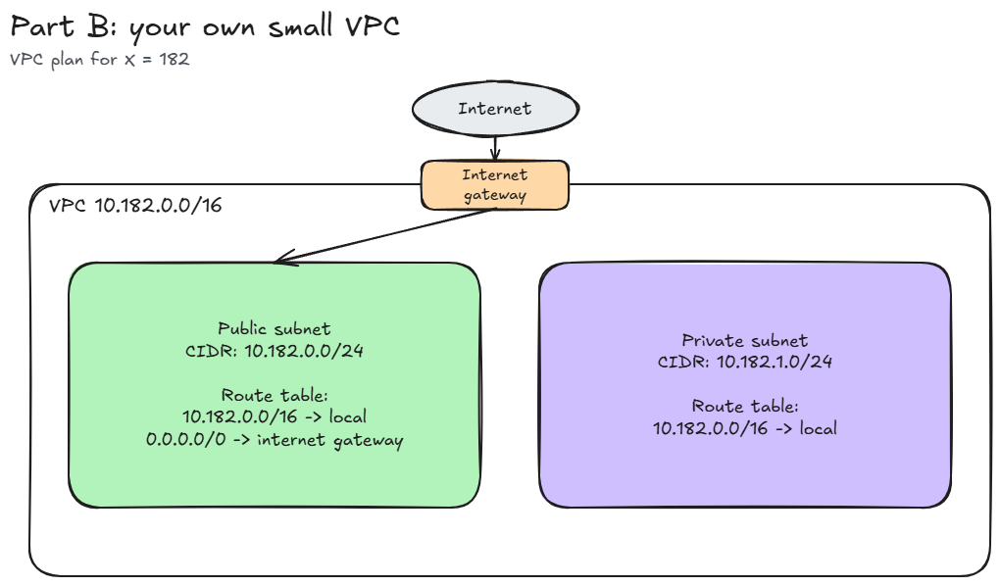

# Assignment 2 Submission

## About me

- GitHub username: MrBep
- Section: IV-ACSAD
- IAM user name that I signed in with: acsad-g05
- X: 182

---

## Part A. Explore

### A1. The VPC

Default VPC IPv4 CIDR:

172.31.0.0/16

Number of addresses in that CIDR:

65,536.

### A2. The subnets

| Availability Zone | IPv4 CIDR |
| --- | --- |
| apse1-az2 (ap-southeast-1a) | 172.31.32.0/20 |
| apse1-az1 (ap-southeast-1b) | 172.31.16.0/20 |
| apse1-az3 (ap-southeast-1c) | 172.31.0.0/20 |

Screenshot 1. Save it as `screenshot-1-subnets.png` in your folder. The image line below shows it.

### A3. Available addresses

Available IPv4 addresses in each subnet:

apse1-az2 (ap-southeast-1a) : 4090, apse1-az1 (ap-southeast-1b) : 4091, apse1-az3 (ap-southeast-1c) : 4091

Why is the number lower than 4,096?

AWS reserves 5 IP addresses in every subnet, so a /20 subnet has 4,091 usable addresses instead of 4,096.

What uses the missing address in the subnet with the lowest number?

The subnet with the lowest number of available addresses is apse1-az2 (ap-southeast-1a), 
which has 4,090 available addresses. Since a /20 subnet normally has 4,091 usable addresses 
after AWS reserves five addresses, one additional address is currently being used. This 
address is assigned to a network interface, which holds an IP address from the subnet. Even 
if the associated EC2 instance is stopped, the network interface can still retain the address. 
In this case, the address is being used by the network interface of an EC2 instance, such as the one from Lab 2.

### A4. The route table

| Destination | Target |
| --- | --- |
| 172.31.0.0/16 | local |
| 0.0.0.0/0 | igw-... |

Screenshot 2. Save it as `screenshot-2-routes.png` in your folder. The image line below shows it.

### A5. Public or private

Are the default subnets public or private? Which route proves it?

The default subnets are public because their route table has a route from 0.0.0.0/0 to igw-... ,which is an internet gateway. 
A subnet is public when it has a route that sends internet traffic (0.0.0.0/0) to an internet gateway. 
The other route, 172.31.0.0/16 to local, is a normal route that every route table has. 
So, the 0.0.0.0/0 route to the internet gateway is what makes the subnets public.

### A6. The internet gateway

State of the internet gateway:

Attached

What happens to the default subnets if the gateway is detached?

If the internet gateway is detached, the 0.0.0.0/0 route will no longer have a working connection to the internet. 
The default subnets will no longer be public, so instances with public IP addresses cannot be reached from the internet or access the internet. 
However, devices inside the VPC can still communicate with each other because the 172.31.0.0/16 local route is still available.

### A7. NAT gateways

Number of NAT gateways:

0

Can a server in a new private subnet download updates? Why?

No. A private subnet does not have a route to an internet gateway. It only has the local route, so the server has no direct path to the internet. 
Because there is no route for 0.0.0.0/0, the server cannot access the internet or download updates. 
The account also has no NAT gateways. A NAT gateway would allow a server in a private subnet to connect to the internet and receive the response. 
Without a NAT gateway, the server cannot access the internet.

### A8. The network ACL

| Rule number | Source | Allow or Deny |
| --- | --- | --- |
| 100 | 0.0.0.0/0 | Allow |
| * | 0.0.0.0/0 | Deny |

How is a network ACL different from a security group?

A network ACL protects an entire subnet, while a security group protects a specific resource, such as an EC2 instance. 
A network ACL is stateless, which means reply traffic needs a separate rule. It can also have both allow and deny rules. 
On the other hand, a security group is stateful and only uses allow rules. In this network ACL, rule '100' allows all traffic from '0.0.0.0/0' . 
AWS checks the rules starting with the lowest number and stops when it finds a match, so the '*' deny rule is not reached.

Screenshot 3. Save it as `screenshot-3-network-acl.png` in your folder. The image line below shows it.

### A9. The default security group

Inbound rule (type and source):

All traffic, from source 'sg-...' ., which is the 'default' security group itself.

Which resources can send traffic to an instance that uses it?

Only resources that belong to the same default security group, sg-... , can send traffic to the instance. 
The inbound rule uses the security group as the source instead of allowing an address range like 0.0.0.0/0 . 
This means traffic from the internet or from resources in other security groups is blocked. 
This is similar to the layered design explained in Section 12, where a security group can be used as the source of a rule. 

---

## Part B. Prepare

### B1. Plan two subnets

- Public subnet CIDR: 10.182.0.0/24
- Private subnet CIDR: 10.182.1.0/24 

### B2. Route tables

Route table of the public subnet:

| Destination | Target |
| --- | --- |
| 10.182.0.0/16 | local |
| 0.0.0.0/0 | internet gateway|

Route table of the private subnet:

| Destination | Target |
| --- | --- |
| 10.182.0.0/16 | local |

### B3. My VPC diagram

Tool used (Excalidraw, draw.io, Lucidchart, or paper):

Excalidraw

Save your diagram as `vpc-diagram.png` in your folder. The image line below shows it.

### B4. Predict a change

Can you still open the web page from your laptop? Why?

No. If the 0.0.0.0/0 route to the internet gateway is removed, the public subnet only has the local route 10.182.0.0/16. This means it no longer 
has a path to the internet and is no longer a public subnet. Even if the instance has a public IP address and the security group allows 
HTTP traffic on port 80, my laptop cannot reach the instance because there is no route to the internet. The response also cannot return to my laptop.

Can the instance still reach another instance in the VPC? Why?

Yes, it can still communicate. Removing the 0.0.0.0/0 route only removes the internet connection. 
The local route 172.31.0.0/16 is still available, allowing instances and subnets within the VPC to communicate with each other. 
Therefore, internal communication is still possible as long as the security groups allow the traffic.

### B5. Place a database

Which subnet gets the database? Why?

The private subnet is 10.182.1.0/24. Since its route table does not have a route to an internet gateway, 
people from the internet cannot directly access the database. However, the web server in the public subnet can still connect to the database 
using the local route.

### B6. My question about VPCs

What is your question, and what made you think of it?

If a stopped instance still uses an address in its subnet, how can I free that address without deleting the instance?

What made me think of it: 
In Part A, when I looked at the available IPv4 addresses in each subnet, the subnet in ap-southeast-1a had 4,090 instead of 4,091. 
The README says a network interface keeps its address while the instance is stopped, so I wondered whether that address can be released.
